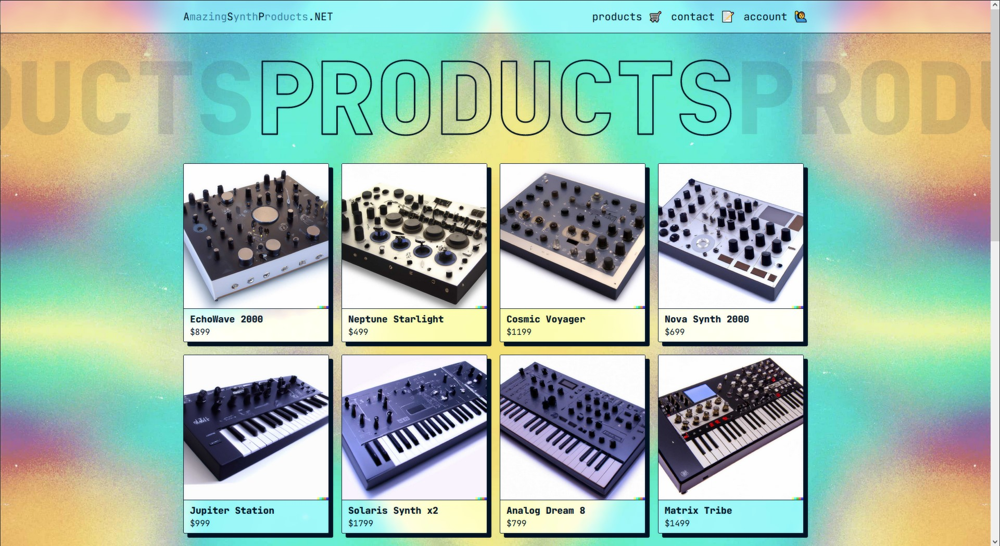

# **AmazingSynthProducts.NET** 🎹

Web store app made with [ASP.NET Core MVC](https://learn.microsoft.com/en-us/aspnet/core/mvc/overview) and [Entity Framework Core](https://learn.microsoft.com/en-us/ef/core/). Part of course submission for _ASP.NET_ at _ECUtbildning 2023_.

---

## **About this app**

_- AmazingSynthProducts.NET is a simple mock web store with account registration/login/overview, product pages and a customer contact form_

The database schema is set up with Entity Framework using a code-first approach and the data is stored in a local SQLite file: `webapp.db`. Accounts are created using the [ASP.NET Core Identity API](https://learn.microsoft.com/en-us/aspnet/core/security/authentication/identity). The first user to register an account is automatically assigned the role of **Admin**. This site was mainly created to get familiar with and practice ASP.NET Core and the Controller workflow.

<br>

### **HOME PAGE**


This is the _Home page_ of the website. It includes a showcase of one selected product and sections with products in different categories (popular, new, featured).

<br>

### **PRODUCTS PAGE**


This is the _Products page_ of the website. All available products are listed here as links that will take you to a product details page.

<br>

### **CONTACT PAGE**


This is the _Contact page_ of the website. Here you can submit a contact message for the users with admin roles. All forms are validated on the front-end when typing and on the back-end when submitting.

<br>

### **ADMIN PAGE**


This is the _Admin page_ of the website. Here you get an overview of all registered users and the submitted contact messages.

<br>

### **OTHER PAGES**

Additional pages includes Login, Register, Account Overview, Access denied etc.

---

<br>

## **Running the app locally**

❗ Make sure you have the latest version of the [.NET sdk](https://dotnet.microsoft.com/en-us/download/dotnet) installed ❗

Clone this repo on your local machine:

```sh
$ git clone https://github.com/simon-off/amazing-synth-products.net.git AmazingSynthProducts
$ cd AmazingSynthProducts
```

Start your local app instance by running:

```sh
$ dotnet run --project WebApp
```

---

<br/>

Made with love (and lots of sass) by _[Simon](https://github.com/simon-off)_
